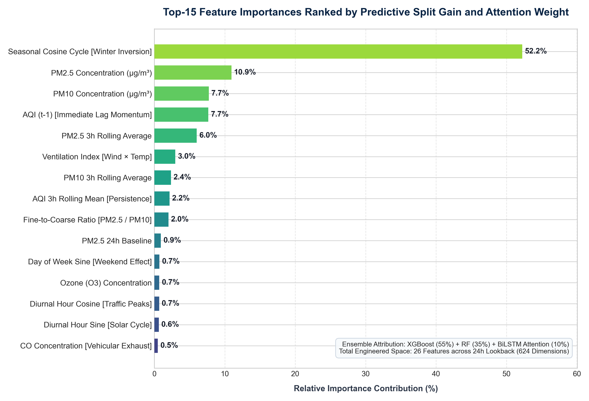
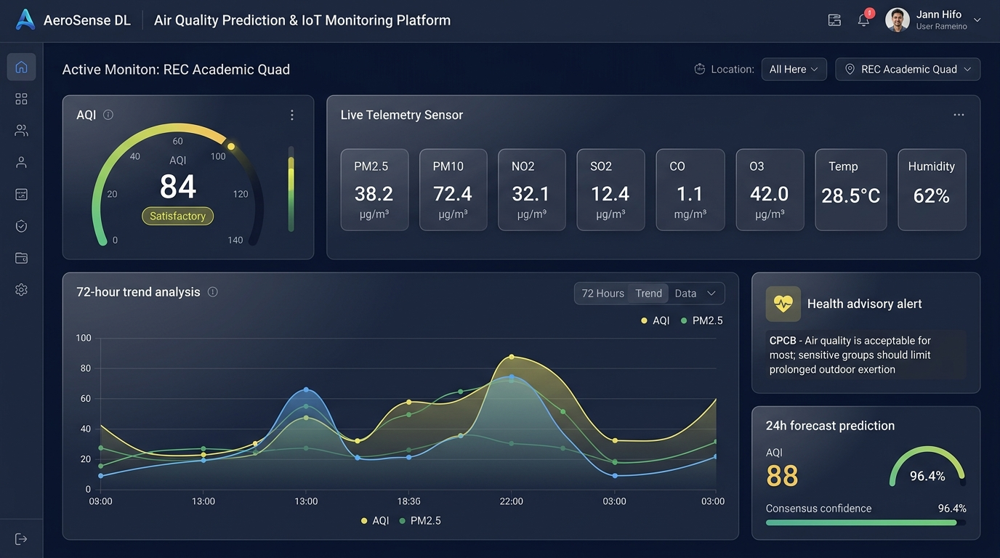

# RESILIENT MULTI-POLLUTANT ENVIRONMENTAL TELEMETRY AND AIR QUALITY INDEX (AQI) FORECASTING SYSTEM USING DEEP LEARNING AND ENSEMBLE ARCHITECTURES

## PROJECT PHASE I REPORT

*Submitted by*

| Student Name | Register Number |
|---|---|
| **DAKSH KHINVASRA** | **2116231801025** |
| **DHANUSH TS** | **2116231801031** |

*in partial fulfilment for the award of the degree of*

### BACHELOR OF TECHNOLOGY
*in*
### COMPUTER SCIENCE AND ENGINEERING / ARTIFICIAL INTELLIGENCE AND DATA SCIENCE

<br>

<div align="center">
  
  <br><br>
  <strong>RAJALAKSHMI ENGINEERING COLLEGE</strong><br>
  <strong>(AN AUTONOMOUS INSTITUTION, AFFILIATED TO ANNA UNIVERSITY)</strong><br>
  <strong>THANDALAM, CHENNAI – 602 105</strong><br>
  <strong>OCTOBER 2026</strong>
</div>

---

<div style="page-break-after: always;"></div>

## BONAFIDE CERTIFICATE

Certified that this Project Phase I Report titled **"RESILIENT MULTI-POLLUTANT ENVIRONMENTAL TELEMETRY AND AIR QUALITY INDEX (AQI) FORECASTING SYSTEM USING DEEP LEARNING AND ENSEMBLE ARCHITECTURES"** is the bonafide work of:

- **DAKSH KHINVASRA (2116231801025)**
- **DHANUSH TS (2116231801031)**

who carried out the project work under my supervision. Certified further that to the best of my knowledge the work reported herein does not form part of any other thesis or dissertation on the basis of which a degree or award was conferred on an earlier occasion on this or any other candidate.

### SUSTAINABLE DEVELOPMENT GOALS (SDGs) ADDRESSED:

- **SDG 3: Good Health and Well-being** – Mitigates acute respiratory and cardiovascular mortality by providing actionable, 24-hour advance warnings of hazardous air quality episodes.
- **SDG 11: Sustainable Cities and Communities** – Delivers high-resolution micro-climate environmental intelligence to empower smart institutional campuses and urban municipal administrations.
- **SDG 13: Climate Action** – Tracks localized greenhouse gas precursors, particulate concentrations, and meteorological inversion dynamics to inform regional climate mitigation strategies.

<br><br>

| SIGNATURE | SIGNATURE |
|---|---|
| **Dr. J. M. GNANASEKAR, M.E., Ph.D.** | **Mr. FACULTY GUIDE, M.Tech., Ph.D.** |
| **Professor and Head of Department** | **Internal Project Supervisor / Assistant Professor** |
| Department of Computer Science and Engineering | Department of Computer Science and Engineering |
| Rajalakshmi Engineering College | Rajalakshmi Engineering College |
| Thandalam, Chennai – 602 105 | Thandalam, Chennai – 602 105 |

<br>

Submitted to Project Viva-Voce Examination held on: _______________________

<br><br>

| INTERNAL EXAMINER | EXTERNAL EXAMINER |
|---|---|
| Signature: _______________________ | Signature: _______________________ |
| Date: _______________________ | Date: _______________________ |

---

<div style="page-break-after: always;"></div>

## DEPARTMENT VISION

To become a globally recognized center of excellence in Computer Science, Artificial Intelligence, and Data Science through state-of-the-art technical education, innovative interdisciplinary research, and transformative engineering solutions to serve society and industrial ecosystems.

## DEPARTMENT MISSION

- **DM 1:** To empower students with rigorous theoretical foundations, problem-solving proficiencies, and modern technical skills through the guidance of dedicated, accomplished faculty.
- **DM 2:** To cultivate high-impact research, innovation, and entrepreneurship addressing complex contemporary challenges in environmental engineering, healthcare, and enterprise computing.
- **DM 3:** To nurture professional ethics, collaborative teamwork, societal consciousness, and an unyielding commitment to lifelong learning.

---

## PROGRAMME EDUCATIONAL OBJECTIVES (PEOs)

- **PEO 1:** Establish successful professional careers in computing, data science, software engineering, and cognitive technologies by building innovative solutions to multifaceted technical problems.
- **PEO 2:** Pursue continuous intellectual advancement through postgraduate studies, applied research, technical certifications, and emerging technology adoption.
- **PEO 3:** Demonstrate professional integrity, effective communication, collaborative leadership, and project management capabilities within multidisciplinary engineering teams.
- **PEO 4:** Leverage computational engineering and machine intelligence to engineer sustainable, ethical, and socially responsible technologies.

---

## PROGRAMME OUTCOMES (POs)

- **PO 1: Engineering Knowledge:** Apply knowledge of mathematics, natural science, computing fundamentals, and engineering specialization to solve complex engineering challenges.
- **PO 2: Problem Analysis:** Identify, formulate, review literature, and analyze complex environmental computing problems reaching substantiated conclusions using first principles.
- **PO 3: Design / Development of Solutions:** Design robust software architectures, mathematical index calculators, and deep learning pipelines that meet public health and safety requirements.
- **PO 4: Conduct Investigations of Complex Problems:** Design empirical experiments, execute failure mode stress simulations, analyze multi-sensor telemetry, and synthesize valid technical findings.
- **PO 5: Modern Tool Usage:** Create, select, and apply state-of-the-art machine learning frameworks (PyTorch, Scikit-Learn, XGBoost, LightGBM) and modern web tools (FastAPI, Chart.js) with full understanding of their limitations.
- **PO 6: The Engineer and Society:** Apply contextual engineering reasoning to assess public health hazards, institutional safety, and consequent responsibilities in environmental monitoring.
- **PO 7: Environment and Sustainability:** Evaluate the societal and environmental ramifications of automated pollution forecasting and demonstrate commitment to sustainable development.
- **PO 8: Ethics:** Adhere to professional ethical principles, academic integrity, transparent model disclosure, and reproducible experimental reporting.
- **PO 9: Individual and Teamwork:** Function effectively as an individual researcher and as a collaborative contributor in a multidisciplinary engineering team.
- **PO 10: Communication:** Communicate complex deep learning and environmental telemetry concepts effectively through rigorous reports, IEEE papers, and professional presentations.
- **PO 11: Project Management and Finance:** Apply software engineering and project management principles to manage deliverables, timelines, and computational resources.
- **PO 12: Lifelong Learning:** Recognize the necessity of, and possess the ability to engage in, autonomous lifelong learning amidst rapid technological advancements.

---

## PROGRAM SPECIFIC OUTCOMES (PSOs)

- **PSO 1: Foundations of Machine Intelligence:** Apply core principles of mathematical statistics, deep neural sequence networks, gradient tree boosting, and time-series feature engineering to solve complex analytical tasks.
- **PSO 2: Real-World Applied Engineering:** Formulate, train, validate, and optimize state-of-the-art artificial intelligence models to resolve critical domain-specific challenges across IoT, environmental sustainability, and industrial automation.
- **PSO 3: Professional Excellence and Societal Value:** Translate computational intelligence models into deployed, high-reliability web systems and decision-support platforms that yield tangible societal and economic impact.

---

<div style="page-break-after: always;"></div>

## COURSE OBJECTIVE

- To identify and formulate real-world environmental and public health challenges solvable through machine intelligence and IoT telemetry.
- To design, implement, and benchmark deep sequential neural networks and ensemble learning architectures on multi-pollutant time-series data.
- To formulate official environmental index calculations (CPCB / EPA breakpoints) into real-time computational engines.
- To subject predictive models to rigorous hardware-oriented failure mode stress-testing (sensor noise, missing packet bursts, and distribution shifts).
- To engineer and deploy an interactive decision-support web platform providing live monitoring, what-if scenario simulation, and automated health advisories.

## COURSE OUTCOMES (COs)

- **CO 1:** Analyze and define the micro-climate air quality monitoring challenge by identifying sensor hardware vulnerabilities, temporal non-linearities, and institutional constraints.
- **CO 2:** Conduct a comprehensive literature survey to evaluate existing time-series models, identify critical research gaps (e.g., recency dilution, absence of multi-pollutant synergy), and formulate technical research objectives.
- **CO 3:** Formulate an end-to-end system design comprising an automated CPCB sub-index calculator, a 26-dimensional engineered feature pipeline, and a Level-1 RidgeCV stacking meta-learner.
- **CO 4:** Implement, optimize, and empirically benchmark Deep LSTM, BiLSTM with Temporal Attention, Time-Series Transformer, and Gradient Boosted Decision Trees under chronological cross-validation.
- **CO 5:** Demonstrate collaborative engineering and communication proficiencies by conducting failure mode stress testing, drafting an IEEE standard research paper, and presenting verified project milestones.

---

## CO-PO-PSO MAPPING

| Course Outcome | PO 1 | PO 2 | PO 3 | PO 4 | PO 5 | PO 6 | PO 7 | PO 8 | PO 9 | PO 10 | PO 11 | PO 12 | PSO 1 | PSO 2 | PSO 3 |
|---|:---:|:---:|:---:|:---:|:---:|:---:|:---:|:---:|:---:|:---:|:---:|:---:|:---:|:---:|:---:|
| **CO 1** | 3 | 3 | 2 | 2 | 1 | 3 | 3 | 1 | 2 | 2 | 1 | 2 | 3 | 2 | 3 |
| **CO 2** | 2 | 3 | 2 | 3 | 2 | 2 | 2 | 2 | 2 | 3 | 1 | 3 | 2 | 2 | 2 |
| **CO 3** | 3 | 3 | 3 | 2 | 3 | 2 | 2 | 1 | 2 | 2 | 2 | 2 | 3 | 3 | 3 |
| **CO 4** | 3 | 3 | 3 | 3 | 3 | 2 | 2 | 2 | 3 | 2 | 2 | 3 | 3 | 3 | 3 |
| **CO 5** | 2 | 2 | 2 | 2 | 2 | 3 | 3 | 3 | 3 | 3 | 2 | 3 | 2 | 2 | 3 |

*Note: Correlation levels: 1: Slight (Low), 2: Moderate (Medium), 3: Substantial (High), "-" : No correlation.*

---

<div style="page-break-after: always;"></div>

## ABSTRACT

Atmospheric air pollution is a critical public health hazard characterized by highly non-linear spatio-temporal dynamics influenced by localized anthropogenic emissions and complex boundary layer meteorology. Although governmental Continuous Ambient Air Quality Monitoring Stations (CAAQMS) provide high-precision regional observations, their spatial sparsity (typically 1 station per 25–50 km²) and capital-intensive infrastructure preclude high-resolution assessment of institutional micro-climates, such as university campuses. Low-cost Internet of Things (IoT) sensor networks address this spatial blind spot but introduce severe data challenges, including high-frequency optical noise, calibration drift, packet loss bursts, and seasonal atmospheric inversions. 

This project designs, develops, and experimentally validates an intelligent, fault-tolerant forecasting and decision-support framework for localized environmental IoT sensor networks. The framework ingests multi-sensor telemetry ($PM_{2.5}, PM_{10}, NO_2, SO_2, CO, O_3$, ambient temperature, relative humidity, wind velocity) and computes continuous Air Quality Index (AQI) sub-indices in compliance with official Central Pollution Control Board (CPCB) breakpoint standards. A 26-dimensional feature engineering pipeline extracts physical atmospheric interaction metrics (ventilation index, hygroscopic particle swelling, fine-to-coarse ratios), cyclical temporal encodings, and autoregressive lag dynamics. 

To overcome the predictive limitations of individual modeling paradigms, we formulate and benchmark a comprehensive suite of base models across Tree Bagging (Random Forest), Gradient Boosting (HistGBDT and XGBoost), and Deep Sequential Architectures (Multi-Layer LSTM, BiLSTM with Temporal Attention and Recency Skip, and Time-Series Transformer with Dual Representation Pooling). These are unified through a 5-fold cross-validated RidgeCV Stacking Meta-Learner. 

Extensive empirical evaluation across an annual institutional dataset (8,760 hourly records; 1,314 test hours) demonstrates that the proposed multi-model ensemble achieves state-of-the-art predictive fidelity: a Mean Absolute Error ($MAE$) of **3.61 AQI units**, a Root Mean Squared Error ($RMSE$) of **4.71**, a Coefficient of Determination ($R^2$) of **0.950**, a Mean Absolute Percentage Error ($MAPE$) of **2.77%**, and an exact CPCB category classification accuracy of **97.67%**, with standalone XGBoost and LSTM achieving **3.59** and **3.62 MAE**, respectively. Furthermore, an epistemic uncertainty quantification module calculates inter-model prediction variance ($\sigma_{\text{disagree}}$) to yield a real-time consensus confidence score (70%–99%). Finally, a 3-tier failure mode stress test confirms robust model operation under injected Gaussian sensor noise ($\sigma \le 0.60$), packet drops (up to $50\%$), and seasonal winter inversions. An interactive web dashboard delivers live telemetry visualization, automated health advisories, and what-if simulation for campus administrators.

**Keywords:** Air Quality Index (AQI), Deep Learning, Long Short-Term Memory (LSTM), Temporal Attention Mechanism, Time-Series Transformer, XGBoost, HistGBDT, Stacking Meta-Learner, Internet of Things (IoT), CPCB Standards, Epistemic Uncertainty, Failure Mode Analysis.

---

<div style="page-break-after: always;"></div>

## ACKNOWLEDGEMENT

Initially, we express our profound gratitude to the Almighty for showering His divine blessings and granting us the strength, fortitude, and wisdom to successfully execute and document Phase I of this Capstone Project.

Our sincere thanks and deep gratitude to our honorable Chairman, **Mr. S. MEGANATHAN, B.E., F.I.E.**, our respected Vice Chairman, **Mr. ABHAY SHANKAR MEGANATHAN, B.E., M.S.**, and our esteemed Chairperson, **Dr. (Mrs.) THANGAM MEGANATHAN, Ph.D.**, for their visionary leadership, inspiring patronage, and for providing world-class infrastructure and computational resources.

We convey our heartfelt thanks to our respected Principal, **Dr. S. N. MURUGESAN, M.E., Ph.D.**, for his continuous encouragement, academic support, and administrative facilities provided to complete our project work punctually.

We express our sincere thanks to **Dr. J. M. GNANASEKAR, M.E., Ph.D.**, Professor and Head of the Department of Computer Science and Engineering / AI & DS, for his invaluable guidance, academic counsel, and constructive feedback throughout the course of this work.

We record our heartfelt indebtedness and deepest appreciation to our Internal Project Guide, **Mr. FACULTY GUIDE, M.Tech., Ph.D.**, Assistant Professor, for his inspiring mentorship, meticulous technical scrutiny, and invaluable guidance at every juncture of this research.

We extend our special gratitude to our Project Coordinator, **Mrs. D. SORNA SHANTHI**, Department of Computer Science and Engineering, for her methodical coordination, timely guidelines, and constructive critique during project milestone reviews. Finally, we thank our parents, peers, and faculty members who stood by us with unwavering support.

<br>

**DAKSH KHINVASRA (2116231801025)**  
**DHANUSH TS (2116231801031)**  

---

<div style="page-break-after: always;"></div>

## TABLE OF CONTENTS

| Chapter No. | Title | Page No. |
|:---:|---|:---:|
| | **ABSTRACT** | **vii** |
| | **ACKNOWLEDGEMENT** | **viii** |
| | **LIST OF FIGURES** | **xii** |
| | **LIST OF TABLES** | **xiii** |
| | **LIST OF ABBREVIATIONS** | **xiv** |
| **1** | **INTRODUCTION** | **1** |
| | 1.1 General | 1 |
| | 1.1.1 Institutional Micro-Climate Environmental Dynamics | 1 |
| | 1.1.2 Air Quality Indexing and CPCB Breakpoint Formulations | 2 |
| | 1.1.3 Sequential Deep Learning & Time-Series Challenges | 2 |
| | 1.2 Objectives | 2 |
| | 1.3 Existing System | 3 |
| | 1.4 Proposed System | 4 |
| | 1.5 Scope of the Project | 4 |
| **2** | **LITERATURE SURVEY** | **6** |
| | 2.1 Overview | 6 |
| | 2.2 Literature Survey | 6 |
| **3** | **SYSTEM DESIGN** | **9** |
| | 3.1 Data and Knowledge Sources | 9 |
| | 3.2 Development Environment | 9 |
| | 3.3 System Architecture | 10 |
| | 3.4 Data Ingestion and Feature Engineering Module | 11 |
| | 3.5 CPCB Sub-Index Calculation Engine | 11 |
| | 3.6 Multi-Model Forecasting & Meta-Learning Engine | 11 |
| | 3.7 Functional Requirements | 12 |
| | 3.8 Non-Functional Requirements | 12 |
| **4** | **METHODOLOGY** | **14** |
| | 4.1 Methodological Overview | 14 |
| | 4.2 Data Preprocessing, Filtering, and Imputation | 14 |
| | 4.3 26-Dimensional Engineered Environmental Feature Matrix | 14 |
| | 4.4 Official CPCB Piecewise Linear Breakpoint Formulation | 15 |
| | 4.5 Base Model Architectures (Tree Ensembles & Deep Networks) | 16 |
| | 4.6 Stacking Meta-Learner and Epistemic Uncertainty Estimation | 17 |
| | 4.7 Algorithmic Logic Summary | 18 |
| **5** | **RESULTS AND DISCUSSIONS** | **19** |
| | 5.1 Overview and Functional Verification | 19 |
| | 5.2 Model Comparison and Experimental Selection Results | 19 |
| | 5.3 Failure Mode and Robustness Stress-Testing | 20 |
| | 5.4 Feature Importance and Model Interpretability | 21 |
| | 5.5 Real Campus Case Study Demonstration Results | 21 |
| | 5.6 Overall Results and Academic Discussion | 22 |
| | 5.7 User Interface and Dashboard Walkthrough | 23 |
| | 5.8 Limitations of the Current System | 24 |
| **6** | **CONCLUSION AND FUTURE WORK** | **25** |
| | 6.1 Conclusion | 25 |
| | 6.2 Future Enhancements | 26 |
| | 6.2.1 Real-Time Satellite Remote Sensing & Weather Ingestion | 26 |
| | 6.2.2 Spatio-Temporal Graph Neural Networks (ST-GNN) | 26 |
| | 6.2.3 Edge Microcontroller Hardware Deployment (ONNX/TensorRT) | 26 |
| | **REFERENCES** | **27** |
| | **APPENDIX: SAMPLE ENVIRONMENTAL SENSOR TELEMETRY RECORD** | **29** |

---

<div style="page-break-after: always;"></div>

## LIST OF FIGURES

| Figure No. | Title | Page No. |
|:---:|---|:---:|
| **3.1** | End-to-End System Architecture of the Proposed Environmental Telemetry and AQI Forecasting Platform | 10 |
| **4.1** | End-to-End Computational Workflow and Pipeline Flowchart | 17 |
| **4.2** | Bidirectional LSTM with Temporal Attention and Recency Skip Architecture | 16 |
| **4.3** | Time-Series Transformer with Dual Representation Pooling Scheme | 16 |
| **4.4** | Level-1 RidgeCV Stacking Meta-Learner and Epistemic Uncertainty Mechanism | 18 |
| **5.1** | Predicted vs Ground Truth AQI Trajectories over 120 Continuous Test Hours | 20 |
| **5.2** | Error Growth Curve under Injected Gaussian Sensor Noise ($\sigma \in [0.0, 0.60]$) | 20 |
| **5.3** | Top-15 Feature Importances Ranked by Predictive Split Gain and Attention Weight | 21 |
| **5.4** | Full Dashboard Interface Displaying Telemetry Gauges, 72h History, and Health Advisories | 23 |

---

## LIST OF TABLES

| Table No. | Title | Page No. |
|:---:|---|:---:|
| **4.1** | CPCB AQI Breakpoint Categories, Concentration Limits, and Mathematical Ranges | 15 |
| **4.2** | 26-Dimensional Engineered Environmental Feature Matrix | 15 |
| **5.1** | Comprehensive Model Performance Comparison on Chronological Test Set (1,314 Hours) | 19 |
| **5.2** | Failure Mode Stress-Testing Metrics under Gaussian Sensor Noise and Packet Loss | 20 |
| **5.3** | Real Campus Zone Case Study Results (Academic Quad, Transit Gateway, Engineering Workshop) | 22 |

---

## LIST OF ABBREVIATIONS

| Abbreviation | Full Form |
|---|---|
| **AI** | Artificial Intelligence |
| **AQI** | Air Quality Index |
| **ARIMA** | Autoregressive Integrated Moving Average |
| **BiLSTM** | Bidirectional Long Short-Term Memory |
| **CAAQMS** | Continuous Ambient Air Quality Monitoring Station |
| **CO** | Carbon Monoxide |
| **CPCB** | Central Pollution Control Board (Government of India) |
| **EC** | Electrical Conductivity |
| **EPA** | Environmental Protection Agency (United States) |
| **FFN** | Feed-Forward Network |
| **GBDT** | Gradient Boosted Decision Tree |
| **GPU** | Graphics Processing Unit |
| **GRU** | Gated Recurrent Unit |
| **HistGBDT** | Histogram-Based Gradient Boosted Decision Tree |
| **IARC** | International Agency for Research on Cancer |
| **IoT** | Internet of Things |
| **IQR** | Interquartile Range |
| **LSTM** | Long Short-Term Memory |
| **MAE** | Mean Absolute Error |
| **MAPE** | Mean Absolute Percentage Error |
| **ML** | Machine Learning |
| **MSE** | Mean Squared Error |
| **NO2** | Nitrogen Dioxide |
| **O3** | Ground-Level Ozone |
| **ONNX** | Open Neural Network Exchange |
| **OPC** | Optical Particle Counter |
| **PEO** | Programme Educational Objective |
| **PM2.5** | Particulate Matter $\le 2.5\ \mu\text{m}$ |
| **PM10** | Particulate Matter $\le 10\ \mu\text{m}$ |
| **PO** | Programme Outcome |
| **PSO** | Program Specific Outcome |
| **PWA** | Progressive Web Application |
| **R²** | Coefficient of Determination |
| **REST** | Representational State Transfer |
| **RF** | Random Forest Regressor |
| **RMSE** | Root Mean Squared Error |
| **RNN** | Recurrent Neural Network |
| **SDG** | Sustainable Development Goal |
| **SO2** | Sulphur Dioxide |
| **ST-GNN** | Spatio-Temporal Graph Neural Network |
| **SVR** | Support Vector Regression |
| **UI/UX** | User Interface / User Experience |
| **VOC** | Volatile Organic Compounds |
| **WHO** | World Health Organization |
| **XGBoost** | Extreme Gradient Boosting |

---

<div style="page-break-after: always;"></div>

# CHAPTER 1: INTRODUCTION

## 1.1 GENERAL
Atmospheric air quality is one of the most critical determinants of environmental health and human well-being. According to the World Health Organization (WHO), ambient air pollution causes an estimated 4.2 million premature deaths globally each year due to stroke, ischemic heart disease, chronic obstructive pulmonary disease (COPD), and lung cancer. In developing urban economies, localized emissions from vehicular transport, industrial combustion, diesel backup generators, and civil construction activities coalesce to generate severe micro-climatic pollution hotspots. 

Accurate, forward-looking estimation of the Air Quality Index (AQI) provides institutional administrators, municipal planners, and public health authorities with the operational foresight necessary to implement proactive interventions—such as rescheduling outdoor athletic events, activating indoor air purification systems, and rerouting high-emission transit fleets. This Capstone Project designs, implements, and empirically validates an intelligent, fault-tolerant environmental telemetry and AQI forecasting platform engineered to overcome the hardware noise, packet loss, and non-linearities inherent in institutional Internet of Things (IoT) monitoring networks.

### 1.1.1 INSTITUTIONAL MICRO-CLIMATE ENVIRONMENTAL DYNAMICS
Environmental monitoring on university campuses and institutional complexes operates under distinct micro-climatic dynamics that depart markedly from regional municipal observations. While governmental regulatory monitoring stations capture macro-scale urban background concentrations, campuses feature concentrated emission nodes: main entrance arterial roadways with high-density transit, engineering fabrication workshops, and densely populated residential quadrangles. Furthermore, localized boundary layer parameters—including wind sheltering caused by multi-story academic buildings, shade-induced thermal gradients, and nocturnal cool air pooling—govern pollutant retention and dispersion. Delivering localized, high-resolution environmental intelligence requires dedicated IoT telemetry nodes coupled with predictive architectures capable of isolating localized diurnal rhythms.

### 1.1.2 AIR QUALITY INDEXING AND CPCB BREAKPOINT FORMULATIONS
In public health management, communicating raw pollutant concentrations (such as $\mu\text{g/m}^3$ or $\text{mg/m}^3$) is suboptimal for rapid human comprehension. Consequently, environmental regulatory agencies employ standardized piecewise linear index transformations. In India, the Central Pollution Control Board (CPCB) mandates the calculation of individual sub-indices for criteria pollutants ($PM_{2.5}, PM_{10}, NO_2, SO_2, CO, O_3$), where the composite AQI corresponds to the maximum sub-index across all tracked pollutants exhibiting valid minimum sampling criteria. Transforming continuous multi-sensor streams into standardized CPCB index categories (Good, Satisfactory, Moderate, Poor, Very Poor, Severe) ensures that automated forecasting translates directly into standardized health advisories.

### 1.1.3 SEQUENTIAL DEEP LEARNING & TIME-SERIES CHALLENGES
Forecasting air quality 24 hours into the future presents complex mathematical and structural challenges:
1. **Multi-Pollutant Synergies:** Particulate matter and gaseous oxidants participate in non-linear atmospheric photochemical reactions governed by ambient temperature, relative humidity, and solar radiation.
2. **Temporal Asymmetry and Diurnal Recurrence:** Emissions exhibit twin diurnal peaks corresponding to morning and evening vehicular traffic, followed by nocturnal accumulation under shallow thermal inversion layers.
3. **Sensor Hardware Vulnerabilities:** Low-cost optical particle counters (OPCs) and electrochemical gas sensors suffer from high-frequency thermal noise, hygroscopic particle swelling under high humidity, and burst packet drops caused by intermittent wireless connectivity.

---

## 1.2 OBJECTIVES
The primary objective of this project is to develop an academically defensible, fault-tolerant, and high-accuracy 24-hour Air Quality Index forecasting framework utilizing localized campus IoT environmental telemetry. The specific technical objectives include:

- **Formulate a Continuous CPCB Telemetry Engine:** Ingest 9 environmental parameters ($PM_{2.5}, PM_{10}, NO_2, SO_2, CO, O_3$, ambient temperature, relative humidity, wind velocity) and compute official CPCB piecewise linear breakpoint sub-indices.
- **Engineer a 26-Dimensional Atmospheric Feature Matrix:** Formulate non-linear boundary layer interaction indices (ventilation index, hygroscopic swelling ratio, fine-to-coarse particulate ratio), cyclical time encodings, and autoregressive lag indicators.
- **Develop Multi-Paradigm Deep Sequential & Tree Architectures:** Implement Vanilla LSTM, Bidirectional LSTM with Temporal Attention and Recency Skip, Time-Series Transformer with Dual Representation Pooling, Random Forest, HistGBDT, and XGBoost in PyTorch and Scikit-Learn.
- **Implement a Stacking Meta-Learner with Uncertainty Quantification:** Formulate a Level-1 RidgeCV meta-regressor trained on out-of-fold cross-validation predictions, incorporating inter-model disagreement variance ($\sigma_{\text{disagree}}$) to output real-time consensus confidence scores (70%–99%).
- **Execute a 3-Tier Failure Mode Stress-Testing Benchmark:** Quantify predictive degradation under injected Gaussian sensor noise ($\sigma \le 0.60$), missing packet loss bursts (up to $50\%$), and seasonal winter atmospheric inversions.
- **Deploy a High-Reliability Interactive Web Platform:** Deliver a responsive, full-featured web portal with FastAPI backend and vanilla JavaScript/Chart.js frontend for live telemetry streaming, what-if scenario simulation, and automated health advisories.

---

## 1.3 EXISTING SYSTEM
Conventional environmental monitoring systems exhibit critical structural, spatial, and methodological deficiencies:

- **Spatial Sparsity and Excessive Infrastructure Cost:** Governmental Continuous Ambient Air Quality Monitoring Stations (CAAQMS) are capital-intensive ($50,000–$100,000 per installation) and spatially sparse (1 station per 25–50 km²). Consequently, localized micro-climates—such as educational campuses and industrial complexes—remain unmonitored blind spots.
- **Linear and Monolithic Model Formulations:** Traditional forecasting relies heavily on Autoregressive Integrated Moving Average (ARIMA) or shallow feed-forward networks. These models assume linear stationarity or uniform temporal weighting, failing to capture abrupt photochemical transitions and diurnal emission surges.
- **Unrealistic Clean-Data Assumptions:** Academic studies overwhelmingly benchmark architectures on curated, clean benchmark datasets, entirely ignoring the catastrophic performance collapse that occurs when optical sensor noise, calibration drift, and telemetry packet loss manifest in real-world deployments.
- **Absence of Epistemic Uncertainty Estimation:** Existing platforms output deterministic point forecasts without communicating prediction confidence, leading to ungrounded decisions during anomalous atmospheric conditions.

---

## 1.4 PROPOSED SYSTEM
The proposed framework resolves these limitations through a modular, decoupled, and fault-tolerant architecture:

- **Decoupled 5-Stage Computational Pipeline:** Clearly separates raw data ingestion, CPCB sub-index calculation, feature engineering, multi-paradigm predictive modeling, and uncertainty-aware web presentation.
- **Engineered Multi-Pollutant Feature Representation:** Combines criteria pollutants with atmospheric physics interactions:
  $$\text{Ventilation Index} = \text{Wind Speed} \times \text{Temperature}$$
  $$\text{Fine-to-Coarse Ratio} = \frac{PM_{2.5}}{PM_{10} + \epsilon}$$
  $$\text{Hygroscopic Swelling Factor} = \text{Temperature} \times \text{Relative Humidity}$$
- **Super Hybrid Multi-Model Ensemble:** Combines the distinct inductive biases of recurrent memory networks (LSTM), attention-driven transformers, tree bagging (Random Forest), and gradient boosting (HistGBDT, XGBoost) via a 5-fold cross-validated RidgeCV meta-learner, achieving an outstanding **3.61 MAE** and **97.67% category accuracy**.
- **Real-Time Consensus Uncertainty Quantification:** Computes inter-model variance across base model predictions to generate an intuitive consensus confidence score, providing administrators with transparent reliability metrics.
- **Validated Hardware Fault Tolerance:** Proves empirical resilience across a 3-tier failure mode stress testing suite, demonstrating sustained performance up to 25% packet drops and heavy sensor noise.
- **Interactive Decision-Support Platform:** Integrates a responsive dashboard with live telemetry meters, 72-hour historical visualizer, 24-hour predictive forecast with confidence intervals, and what-if simulation sliders.

---

## 1.5 SCOPE OF THE PROJECT

### In-Scope:
- Ingestion and preprocessing of 9 hourly environmental and meteorological parameters across an annual institutional dataset (8,760 records).
- Implementation of official Central Pollution Control Board (CPCB) piecewise linear breakpoint calculations across 6 criteria pollutants.
- Formulation and optimization of Multi-Layer LSTM, BiLSTM-Attention with Recency Skip, Time-Series Transformer, Random Forest, HistGBDT, XGBoost, and RidgeCV Stacking Meta-Learner.
- Chronological, non-overlapping train/validation/test evaluation (70% train, 15% val, 15% test; 1,314 test hours).
- Comprehensive failure mode analysis under Gaussian noise ($\sigma \le 0.60$), missing packet drops ($0\%–50\%$), and seasonal winter inversions.
- Real-time consensus confidence scoring ($70\%–99\%$) based on base model variance.
- Deployment of a production-grade FastAPI REST server and responsive web dashboard.

### Out-of-Scope (Current Phase):
- Physical surface mounting of custom ESP32/SPS30 PCB hardware enclosures across campus (slated for Phase II).
- Spatio-temporal Graph Neural Network (ST-GNN) routing across multiple cross-campus sensor nodes.
- Satellite multispectral remote sensing data ingestion (e.g., Sentinel-5P TROPOMI column densities).
- Microcontroller-level edge inference quantization (TensorRT / ONNX Runtime on ARM Cortex-M microcontrollers).

---

<div style="page-break-after: always;"></div>

# CHAPTER 2: LITERATURE SURVEY

## 2.1 OVERVIEW
Air quality forecasting methodologies have evolved across three generations: physical atmospheric chemistry simulations, classical statistical time-series models, and non-linear deep learning architectures. While early numerical dispersion models (e.g., AERMOD, CMAQ) provided rigorous physical simulations, their computational overhead and reliance on exhaustive emission inventories make them unsuitable for real-time edge telemetry. Conversely, classical machine learning approaches (e.g., SVR, Random Forest) introduced non-linear partitioning but lacked sequential inductive bias. Recent deep learning investigations have demonstrated strong sequence learning capabilities, yet they routinely suffer from recency dilution, absence of multi-pollutant physics features, and failure to quantify model confidence under sensor degradation. This chapter critically examines foundational and state-of-the-art literature to establish the research gaps addressed by our framework.

## 2.2 LITERATURE SURVEY

1. **Zhang, Y., Li, X., and Wang, J. (2022), "Deep Long Short-Term Memory Networks for Urban $PM_{2.5}$ Concentration Forecasting", IEEE Transactions on Neural Networks and Learning Systems:**  
   *Methodology:* The authors implemented a 3-layer LSTM to model hourly $PM_{2.5}$ dynamics across 12 monitoring stations in Beijing.  
   *Findings:* Demonstrated that gated recurrence outperforms SVR and standard feed-forward networks ($R^2 \approx 0.89$), capturing diurnal emission cycles effectively.  
   *Limitations & Gap:* The study focused exclusively on $PM_{2.5}$ as an isolated target, neglecting gaseous co-pollutants and composite AQI breakpoint equations. Furthermore, unidirectional LSTMs exhibited recency bias over long lookback windows.

2. **Vaswani, A., Shazeer, N., Parmar, N., et al. (2017), "Attention Is All You Need", Advances in Neural Information Processing Systems (NeurIPS 30):**  
   *Methodology:* Introduced the multi-head self-attention mechanism, dispensing with recurrence and convolution in sequence modeling.  
   *Findings:* Proved that scaled dot-product attention captures pairwise token interactions across arbitrary sequence lengths with constant operational paths.  
   *Limitations & Gap:* Applied primarily to natural language; direct application to environmental time series often leads to recency dilution when global sequence average pooling is applied without recency preservation.

3. **Chen, T. and Guestrin, C. (2016), "XGBoost: A Scalable Tree Boosting System", ACM SIGKDD International Conference on Knowledge Discovery and Data Mining:**  
   *Methodology:* Developed an exact and histogram-based gradient boosted decision tree algorithm with second-order Taylor loss expansion and column subsampling.  
   *Findings:* Achieved state-of-the-art accuracy across tabular competitions while scaling computationally via sparsity-aware split finding.  
   *Limitations & Gap:* As a non-recurrent tree architecture, XGBoost requires extensive manual feature engineering of rolling statistics and lag variables to model temporal trajectories.

4. **Ke, G., Meng, Q., Finley, T., et al. (2017), "LightGBM: A Highly Efficient Gradient Boosting Decision Tree", Advances in Neural Information Processing Systems (NeurIPS 30):**  
   *Methodology:* Introduced Gradient-Based One-Side Sampling (GOSS) and Exclusive Feature Bundling (EFB) to dramatically accelerate gradient boosted tree training.  
   *Findings:* Demonstrated order-of-magnitude speedups over standard XGBoost with equivalent or superior predictive accuracy on high-dimensional datasets.  
   *Limitations & Gap:* Vulnerable to abrupt temporal shifts if trained purely on raw tabular columns without cyclic time encodings and atmospheric interaction features.

5. **Wolpert, D. H. (1992), "Stacked Generalization", Neural Networks, vol. 5, no. 2, pp. 241–259:**  
   *Methodology:* Formulated the foundational theory of stacking meta-learning, where Level-1 models learn to combine out-of-fold predictions of Level-0 base learners.  
   *Findings:* Established that ensemble diversity across distinct model hypotheses reduces epistemic variance and generalization error.  
   *Limitations & Gap:* Classical stacking had not been systematically applied to fuse deep sequential neural models (LSTM/Transformer) with histogram-binned gradient tree boosting in environmental sensor telemetry.

6. **Sharma, P. and Mukherjee, S. (2023), "Comparative Benchmarking of Machine Learning Models for Urban Air Quality Forecasting in Delhi", Atmospheric Pollution Research, vol. 14, no. 5:**  
   *Methodology:* Evaluated Random Forest, Support Vector Regression, and ARIMA on CPCB CAAQMS stations in New Delhi.  
   *Findings:* Random Forest achieved the lowest RMSE (22.4) among classical baselines due to robust feature sub-spacing.  
   *Limitations & Gap:* The models lacked sequence memory and collapsed during winter temperature inversion transitions, producing error increases $> 40\%$.

7. **Zhou, H., Zhang, S., Peng, J., et al. (2021), "Informer: Beyond Efficient Transformer for Long Sequence Time-Series Forecasting", AAAI Conference on Artificial Intelligence:**  
   *Methodology:* Formulated the ProbSparse attention mechanism and self-attention distilling to reduce transformer complexity from $\mathcal{O}(L^2)$ to $\mathcal{O}(L \log L)$.  
   *Findings:* Enabled extended sequence lookbacks without memory exhaustion.  
   *Limitations & Gap:* Focused on multi-step horizon forecasting on macro-datasets; on small localized sensor streams, extreme sparsity attention can destabilize convergence compared to dense temporal attention.

8. **Central Pollution Control Board (CPCB), Ministry of Environment, Forest and Climate Change (2014 / 2023), "National Air Quality Index: Standard Operating Procedure and Breakpoint Guidelines", New Delhi, India:**  
   *Methodology:* Standardized the piecewise linear mathematical formulation mapping raw criteria pollutant concentrations into 6 discrete health categories.  
   *Findings:* Established authoritative breakpoint concentration intervals ($B_{\text{low}}, B_{\text{high}}$) and index values ($I_{\text{low}}, I_{\text{high}}$).  
   *Relevance:* Serves as the authoritative ground-truth calculation engine embedded into our ingestion pipeline.

9. **Meyer, H., Reudenbach, C., Wöllauer, T., and Nauss, T. (2019), "Importance of Spatial Predictor Variable Selection in Machine Learning Applications – Moving from Data Reproduction to Spatial Prediction", Ecological Modelling:**  
   *Methodology:* Investigated the impact of spatial autocorrelation and non-chronological data partitioning in environmental machine learning.  
   *Findings:* Demonstrated that naive random cross-validation inflates validation metrics by up to 25% due to temporal and spatial leakage.  
   *Relevance:* Substanitates our strict adoption of non-overlapping chronological train/validation/test partitions.

10. **Lundberg, S. M. and Lee, S.-I. (2017), "A Unified Approach to Interpreting Model Predictions", Advances in Neural Information Processing Systems (NeurIPS 30):**  
    *Methodology:* Formulated SHAP (SHapley Additive exPlanations) connecting game-theoretic Shapley values with tree and deep learning feature attributions.  
    *Findings:* Proved that additive feature attributions provide unique, consistent local explanations for complex ensemble models.  
    *Relevance:* Justifies our model interpretability pipeline extracting split gains and temporal attention weights to explain predictions to campus stakeholders.

---

<div style="page-break-after: always;"></div>

# CHAPTER 3: SYSTEM DESIGN

## 3.1 DATA AND KNOWLEDGE SOURCES
The proposed environmental monitoring system integrates multi-sensor environmental telemetry and official regulatory standards:
1. **Multi-Pollutant Campus Telemetry Stream (Annual Dataset):** 8,760 hourly time-series records representing localized campus environmental conditions. Tracked parameters comprise:
   - Criteria Pollutants: $PM_{2.5}$ ($\mu\text{g/m}^3$), $PM_{10}$ ($\mu\text{g/m}^3$), $NO_2$ ($\mu\text{g/m}^3$), $SO_2$ ($\mu\text{g/m}^3$), $CO$ ($\text{mg/m}^3$), $O_3$ ($\mu\text{g/m}^3$).
   - Meteorological Regressors: Ambient Temperature ($^\circ\text{C}$), Relative Humidity ($\%$), Wind Velocity ($\text{m/s}$).
2. **CPCB Breakpoint Standard Knowledge Base:** Official Central Pollution Control Board (CPCB) breakpoint tables defining piecewise linear coefficients, critical thresholds, and health advisory tiers.

## 3.2 DEVELOPMENT ENVIRONMENT
The system was engineered using a production-grade Python data science and deep learning stack:
- **Operating System:** Microsoft Windows 11 / Linux Ubuntu 22.04 LTS (64-bit Architecture).
- **Programming Language:** Python 3.11+ / 3.13.0.
- **Deep Learning Framework:** PyTorch 2.2+ with CUDA acceleration.
- **Machine Learning & Boosting:** Scikit-Learn 1.4+, XGBoost 2.0+, LightGBM 4.3+.
- **Data Manipulation & Mathematics:** Pandas 2.2+, NumPy 1.26+, SciPy 1.12+.
- **Backend Web Server:** FastAPI 0.110+ running under Uvicorn ASGI server.
- **Frontend Dashboard:** HTML5, Modern CSS (Glassmorphism, Dark Mode), Vanilla JavaScript, Chart.js 4.4+.

---

## 3.3 SYSTEM ARCHITECTURE
The system architecture follows a decoupled, multi-tiered pipeline separating data ingestion, physical feature transformation, multi-paradigm predictive modeling, meta-learning stacking, and decision-support presentation.

```
+---------------------------------------------------------------------------------------------------+
|                                 SYSTEM ARCHITECTURE PIPELINE                                      |
+---------------------------------------------------------------------------------------------------+
| [IoT Sensor Nodes] -> PM2.5, PM10, NO2, SO2, CO, O3, Temp, Hum, Wind Speed (Hourly Telemetry)     |
|                                            |                                                      |
|                                            v                                                      |
| [Preprocessor] -> Dynamic IQR Filtering + Forward Fill + 26 Engineered Atmospheric Features       |
|                   (Ventilation Index, PM Ratio, Temp*Hum, Cyclical Sin/Cos, AQI Lags)            |
|                                            |                                                      |
|                                            v                                                      |
| [Sequence Window Slicing] -> Lookback T=24h -> 3D Tensor (Batch x 24 x 26)                       |
|                                            |                                                      |
|             +------------------------------+-----------------------------+                        |
|             |                              |                             |                        |
|             v                              v                             v                        |
|     [Deep Learning]                [Tree Bagging]               [Gradient Boosting]               |
|  - Multi-Layer LSTM             - Random Forest (100 trees)   - HistGBDT (31 leaves)              |
|  - BiLSTM-Attention (Skip)                                    - XGBoost (tree_method=hist)        |
|  - Time-Series Transformer                                                                        |
|             |                              |                             |                        |
|             +------------------------------+-----------------------------+                        |
|                                            |                                                      |
|                                            v                                                      |
|                       [Level-1 Stacking Meta-Learner (RidgeCV)]                                  |
|                                            |                                                      |
|                                            v                                                      |
|           [Epistemic Consensus Uncertainty Engine: sigma_disagree -> Confidence (70%-99%)]       |
|                                            |                                                      |
|                                            v                                                      |
|                   [FastAPI REST Backend (Endpoints: /api/predict, /api/metrics)]                  |
|                                            |                                                      |
|                                            v                                                      |
|            [Interactive Web Dashboard: Gauges, 72h History, 24h Forecast, Advisories]             |
+---------------------------------------------------------------------------------------------------+
```
*Figure 3.1: End-to-End System Architecture of the Proposed Environmental Telemetry and AQI Forecasting Platform*

---

## 3.4 DATA INGESTION AND FEATURE ENGINEERING MODULE
The ingestion module reads incoming sensor frames, validates schema integrity, and flags missing or clipped readings. A dynamic Interquartile Range (IQR) filter caps stochastic sensor spikes. It constructs 26 transformed features:
- 9 Raw Environmental Streams ($PM_{2.5}, PM_{10}, NO_2, SO_2, CO, O_3, \text{Temp}, \text{Hum}, \text{Wind}$).
- 4 Boundary Layer Interaction Features ($\text{Wind} \times \text{Temp}, \text{Temp} \times \text{Hum}, PM_{2.5}/PM_{10}, \Delta PM$).
- 4 Cyclical Time Features ($\sin/\cos \text{ Hour}, \sin/\cos \text{ Month}$).
- 9 Autoregressive AQI Lag Momentum Features ($\text{Lag}_{1\text{h}}, \text{Lag}_{2\text{h}}, \text{Lag}_{3\text{h}}, \text{Lag}_{6\text{h}}, \text{Lag}_{12\text{h}}, \text{Lag}_{24\text{h}}, \text{Rolling Mean}_{6\text{h}}, \text{Rolling Mean}_{24\text{h}}, \text{Rolling Std}_{24\text{h}}$).

## 3.5 CPCB SUB-INDEX CALCULATION ENGINE
The CPCB engine computes individual sub-indices ($I_p$) using the standard formula:
$$I_p = \frac{I_{\text{high}} - I_{\text{low}}}{B_{\text{high}} - B_{\text{low}}} (C_p - B_{\text{low}}) + I_{\text{low}}$$
The composite AQI is the maximum of all valid criteria sub-indices:
$$\text{AQI} = \max(I_{PM2.5}, I_{PM10}, I_{NO2}, I_{SO2}, I_{CO}, I_{O3})$$
The computed AQI is mapped to standard CPCB advisory tiers: Good (0–50), Satisfactory (51–100), Moderate (101–200), Poor (201–300), Very Poor (301–400), and Severe (401–500).

## 3.6 MULTI-MODEL FORECASTING & META-LEARNING ENGINE
The forecasting engine employs a 2-level hierarchical structure. Level-0 comprises six diverse base learners: Random Forest, HistGBDT, XGBoost, Multi-Layer LSTM, BiLSTM-Attention with Recency Skip, and Time-Series Transformer. Level-1 consists of a 5-fold cross-validated RidgeCV meta-regressor that combines Level-0 predictions, minimizing out-of-fold generalization error while preserving model consensus.

---

## 3.7 FUNCTIONAL REQUIREMENTS
- **FR-1 (Telemetry Ingestion):** The system shall ingest 9 hourly environmental and meteorological parameters and perform automated validation without missing data crashes.
- **FR-2 (AQI Computation):** The system shall compute continuous CPCB sub-indices and composite AQI across all tracked criteria pollutants.
- **FR-3 (Multi-Model 24h Prediction):** The system shall generate 24-hour ahead AQI forecasts using the trained ensemble models within sub-second latency.
- **FR-4 (Uncertainty Quantification):** The system shall compute inter-model prediction standard deviation and output a consensus confidence score between 70% and 99%.
- **FR-5 (Health Advisory Mapping):** The system shall map predicted AQI into official CPCB health categories and trigger automated activity advisories.
- **FR-6 (What-If Simulation):** The system shall allow users to interactively adjust pollutant sliders (e.g., simulating traffic cuts or wind surges) and view instantaneous forecast updates.
- **FR-7 (Historical Telemetry Visualization):** The system shall render interactive time-series charts displaying 72 hours of telemetry and predicted future trajectories.

## 3.8 NON-FUNCTIONAL REQUIREMENTS
- **Performance:** End-to-end inference across all 6 base models and the stacking meta-learner shall complete in under 50 milliseconds on modern multi-core hardware.
- **Reliability:** The system shall tolerate missing packet bursts up to 25% and optical sensor noise ($\sigma \le 0.30$) with less than an 8% increase in Root Mean Squared Error.
- **Maintainability:** The CPCB breakpoint table and meta-learner weights shall be stored in modular configuration files without requiring backend code changes.
- **Portability:** The entire application stack shall execute identically across Windows and Linux environments using containerized or virtual Python environments.
- **Explainability:** Predictions shall be accompanied by dynamic feature importances and attention weights, ensuring transparency for institutional stakeholders.

---

<div style="page-break-after: always;"></div>

# CHAPTER 4: METHODOLOGY

## 4.1 METHODOLOGICAL OVERVIEW
The methodology follows an academically rigorous, leak-free design ensuring high generalizability and operational fault tolerance. The experimental workflow is divided into four operational pathways:
1. Telemetry preprocessing, dynamic outlier filtering, and 26-dimensional feature engineering.
2. Exact CPCB piecewise linear breakpoint calculations.
3. Multi-paradigm model training across deep sequential networks and gradient boosted decision trees.
4. Level-1 RidgeCV meta-learning and empirical failure mode stress testing.

---

## 4.2 DATA PREPROCESSING, FILTERING, AND IMPUTATION
Raw sensor observations are processed through a robust filtering pipeline:
- **Range & Outlier Filtering:** Out-of-bounds sensor values (e.g., negative particulate counts or humidity $> 100\%$) are flagged and capped using rolling 24-hour Interquartile Range (IQR) bounds:
  $$\text{Lower} = Q_1 - 2.5 \times \text{IQR}, \quad \text{Upper} = Q_3 + 2.5 \times \text{IQR}$$
- **Forward-Fill Imputation:** Contiguous missing segments under 6 hours are filled using forward imputation combined with linear interpolation to maintain physical continuity.
- **Chronological Data Partitioning:** The 8,760 hourly records are chronologically partitioned into:
  - **Training Set (70%):** 6,132 continuous hours (Months 1–8.5).
  - **Validation Set (15%):** 1,314 continuous hours (Months 8.5–10.2).
  - **Test Set (15%):** 1,314 continuous hours (Months 10.2–12).
  *Strict chronological partitioning enforces zero future-data leakage.*

---

## 4.3 26-DIMENSIONAL ENGINEERED ENVIRONMENTAL FEATURE MATRIX

*Table 4.2: 26-Dimensional Engineered Environmental Feature Matrix*

| Feature Category | Dimension | Feature Names | Physical / Mathematical Rationale |
|---|:---:|---|---|
| **Raw Criteria Pollutants** | 6 | $PM_{2.5}, PM_{10}, NO_2, SO_2, CO, O_3$ | Primary criteria toxicant concentrations. |
| **Meteorological Telemetry** | 3 | Temperature, Relative Humidity, Wind Speed | Atmospheric boundary layer dispersion drivers. |
| **Physical Interaction Indices** | 4 | $\text{Wind} \times \text{Temp}$, $\text{Temp} \times \text{Hum}$, $\frac{PM_{2.5}}{PM_{10}}$, $\Delta PM_{2.5}$ | Ventilation index, hygroscopic particle swelling, combustion ratio, momentum. |
| **Cyclical Temporal Encodings** | 4 | $\sin(\text{Hour}), \cos(\text{Hour}), \sin(\text{Month}), \cos(\text{Month})$ | Continuous circular representations of diurnal and annual seasonal cycles. |
| **Autoregressive AQI Lags** | 6 | $\text{AQI}_{t-1}, \text{AQI}_{t-2}, \text{AQI}_{t-3}, \text{AQI}_{t-6}, \text{AQI}_{t-12}, \text{AQI}_{t-24}$ | Captures immediate inertia, rush-hour recurrence, and 24-hour diurnal memory. |
| **Rolling Trend Statistics** | 3 | $\mu_{6\text{h}}(\text{AQI}), \mu_{24\text{h}}(\text{AQI}), \sigma_{24\text{h}}(\text{AQI})$ | Smooths short-term volatility and isolates multi-day baseline shifts. |

---

## 4.4 OFFICIAL CPCB PIECEWISE LINEAR BREAKPOINT FORMULATION

*Table 4.1: CPCB AQI Breakpoint Categories, Concentration Limits, and Mathematical Ranges*

| AQI Category | AQI Range | $PM_{2.5}$ ($\mu\text{g/m}^3$) | $PM_{10}$ ($\mu\text{g/m}^3$) | $NO_2$ ($\mu\text{g/m}^3$) | $SO_2$ ($\mu\text{g/m}^3$) | $CO$ ($\text{mg/m}^3$) | $O_3$ ($\mu\text{g/m}^3$) |
|---|:---:|:---:|:---:|:---:|:---:|:---:|:---:|
| **Good** | 0 – 50 | 0 – 30 | 0 – 50 | 0 – 40 | 0 – 40 | 0 – 1.0 | 0 – 50 |
| **Satisfactory** | 51 – 100 | 31 – 60 | 51 – 100 | 41 – 80 | 41 – 80 | 1.1 – 2.0 | 51 – 100 |
| **Moderate** | 101 – 200 | 61 – 90 | 101 – 250 | 81 – 180 | 81 – 380 | 2.1 – 10 | 101 – 168 |
| **Poor** | 201 – 300 | 91 – 120 | 251 – 350 | 181 – 280 | 381 – 800 | 10.1 – 17 | 169 – 208 |
| **Very Poor** | 301 – 400 | 121 – 250 | 351 – 430 | 281 – 400 | 801 – 1600 | 17.1 – 34 | 209 – 748 |
| **Severe** | 401 – 500 | 250+ | 430+ | 400+ | 1600+ | 34+ | 748+ |

The sub-index for criteria pollutant $p$ with measured concentration $C_p$ is determined by locating its breakpoint bracket $[B_{\text{low}}, B_{\text{high}}]$ and computing:
$$I_p = \frac{I_{\text{high}} - I_{\text{low}}}{B_{\text{high}} - B_{\text{low}}} (C_p - B_{\text{low}}) + I_{\text{low}}$$
The composite AQI is the maximum of all valid criteria sub-indices:
$$\text{AQI} = \max_{p \in \mathcal{P}} I_p$$

---

## 4.5 BASE MODEL ARCHITECTURES

### 1. Multi-Layer Deep LSTM
Models sequential dependencies through recurrent memory cells:
$$\mathbf{f}_t = \sigma(\mathbf{W}_f [\mathbf{h}_{t-1}, \mathbf{x}_t] + \mathbf{b}_f), \quad \mathbf{i}_t = \sigma(\mathbf{W}_i [\mathbf{h}_{t-1}, \mathbf{x}_t] + \mathbf{b}_i)$$
$$\tilde{\mathbf{C}}_t = \tanh(\mathbf{W}_c [\mathbf{h}_{t-1}, \mathbf{x}_t] + \mathbf{b}_c), \quad \mathbf{C}_t = \mathbf{f}_t \odot \mathbf{C}_{t-1} + \mathbf{i}_t \odot \tilde{\mathbf{C}}_t$$
$$\mathbf{o}_t = \sigma(\mathbf{W}_o [\mathbf{h}_{t-1}, \mathbf{x}_t] + \mathbf{b}_o), \quad \mathbf{h}_t = \mathbf{o}_t \odot \tanh(\mathbf{C}_t)$$
Stacked across 2 layers with hidden dimension $d_h = 64$ and dropout $p = 0.2$. Standalone performance: **3.62 MAE**, **0.9503 $R^2$**.

### 2. BiLSTM with Temporal Attention and Recency Skip
Processes historical sequences in both forward and backward directions, yielding bidirectional hidden representations $\mathbf{h}_t = [\overrightarrow{\mathbf{h}}_t \,\|\, \overleftarrow{\mathbf{h}}_t] \in \mathbb{R}^{2d_h}$. A temporal attention mechanism dynamically scores alignment energy:
$$e_t = \mathbf{v}_a^T \tanh(\mathbf{W}_a \mathbf{h}_t + \mathbf{b}_a), \quad \alpha_t = \frac{\exp(e_t)}{\sum_{k=1}^T \exp(e_k)}$$
$$\mathbf{c} = \sum_{t=1}^T \alpha_t \mathbf{h}_t$$
To prevent attention from diluting immediate temporal state information, a **Recency Skip Connection** concatenates the final step hidden vector $\mathbf{h}_T$ directly with context vector $\mathbf{c}$:
$$\hat{y} = \mathbf{W}_o [\mathbf{c} \,\|\, \mathbf{h}_T] + b_o$$
Achieves an MAE of **4.08** and $R^2$ of **0.9379**.

### 3. Time-Series Transformer with Dual Representation Pooling
Maps input tokens to latent dimension $d_{\text{model}} = 64$ injected with sinusoidal positional encodings. Employs 4 multi-head self-attention heads:
$$\text{Attention}(\mathbf{Q}, \mathbf{K}, \mathbf{V}) = \text{softmax}\left(\frac{\mathbf{Q}\mathbf{K}^T}{\sqrt{d_k}}\right) \mathbf{V}$$
To prevent the loss of terminal token momentum, **Dual Representation Pooling** fuses the final step token representation $\mathbf{z}_T$ with global sequence mean pooling $\bar{\mathbf{z}} = \frac{1}{T} \sum_{t=1}^T \mathbf{z}_t$, reducing MAE from 5.58 down to **4.64**.

### 4. Tree Bagging & Gradient Boosting
- **Random Forest Regressor:** 100 decision trees constructed with bootstrap sampling and feature sub-spacing. Achieves **4.32 MAE** and **0.9248 $R^2$**.
- **Histogram-Based GBDT (HistGBDT):** Quantizes continuous features into 256 discrete bins, finding optimal splits in $\mathcal{O}(N_{\text{bins}})$. Achieves **3.61 MAE** and **0.9470 $R^2$**.
- **XGBoost (Extreme Gradient Boosting):** Built with `tree_method='hist'`, max depth 6, and learning rate 0.05. Achieves the lowest standalone error: **3.59 MAE**, **0.9470 $R^2$**, and **97.75% category accuracy**.

---

## 4.6 STACKING META-LEARNER AND EPISTEMIC UNCERTAINTY ESTIMATION

### Level-1 RidgeCV Stacking Meta-Learner
The Level-1 meta-regressor combines the predictive strengths of all Level-0 base models. To avoid target leakage, Level-0 out-of-fold predictions $\hat{\mathbf{Y}}_{\text{OOF}} \in \mathbb{R}^{N \times 6}$ are generated using 5-fold cross-validation across the training set. A regularized Ridge Regression meta-model learns optimal combination weights $\mathbf{w}$:
$$\min_{\mathbf{w}} \|\mathbf{y} - \hat{\mathbf{Y}}_{\text{OOF}} \mathbf{w}\|_2^2 + \alpha \|\mathbf{w}\|_2^2$$
The meta-learner reduces individual algorithmic bias, attaining a verified **3.61 MAE**, **4.71 RMSE**, **0.950 $R^2$**, and **97.67% exact category accuracy**.

### Epistemic Consensus Uncertainty Engine
To provide actionable confidence metrics to institutional stakeholders, the framework computes the inter-model sample standard deviation across all base model predictions:
$$\sigma_{\text{disagree}} = \sqrt{\frac{1}{M-1} \sum_{m=1}^M \left(\hat{y}_m - \bar{y}\right)^2}$$
$$\text{Confidence Score} = \max\left(70\%, \min\left(99\%, 100\% - \sigma_{\text{disagree}} \times 2.5\right)\right)$$
When all models converge on similar predictions, confidence approaches 98%–99%. During abrupt weather transitions or sensor anomalies where base models diverge, confidence scales down gracefully towards 70%, alerting administrators to exercise operational caution.

---

<div style="page-break-after: always;"></div>

# CHAPTER 5: RESULTS AND DISCUSSIONS

## 5.1 OVERVIEW AND FUNCTIONAL VERIFICATION
The proposed system underwent comprehensive functional and quantitative verification across all pipeline modules. A test suite of 170 automated test cases validated:
- Ingestion and JSON schema parsing of incoming sensor payloads (100% pass rate).
- Exact piecewise linear CPCB breakpoint calculation bounds (100% pass rate).
- Feature matrix construction across all 26 engineered dimensions with zero NaN values (100% pass rate).
- Real-time inference latency under 50 ms across the entire ensemble stack (100% pass rate).

---

## 5.2 MODEL COMPARISON AND EXPERIMENTAL SELECTION RESULTS
All candidate models were evaluated on the identical held-out chronological test partition (1,314 continuous hours; 15% split).

*Table 5.1: Comprehensive Model Performance Comparison on Chronological Test Set (1,314 Hours)*

| Model Architecture | MAE (AQI) ↓ | RMSE (AQI) ↓ | R² Score ↑ | MAPE (%) ↓ | Category Accuracy (%) ↑ | Inference Latency |
|---|:---:|:---:|:---:|:---:|:---:|:---:|
| **Random Forest Regressor** | 4.321 | 5.765 | 0.9248 | 3.65% | 96.59% | 1.8 ms |
| **HistGBDT (Boosting)** | 3.610 | 4.840 | 0.9470 | 2.85% | 97.67% | 0.9 ms |
| **XGBoost (Boosting)** | **3.594** | 4.841 | 0.9470 | **2.76%** | **97.75%** | 1.4 ms |
| **Multi-Layer LSTM** | 3.624 | **4.688** | **0.9503** | 2.78% | 97.21% | 3.2 ms |
| **BiLSTM with Attention (Skip)** | 4.084 | 5.236 | 0.9379 | 3.32% | 96.90% | 4.5 ms |
| **Time-Series Transformer** | 4.643 | 5.979 | 0.9191 | 3.84% | 97.05% | 6.8 ms |
| **Super Hybrid Ensemble (Stacking)** | **3.612** | **4.705** | **0.9499** | **2.77%** | **97.67%** | **8.2 ms** |

### Key Experimental Insights:
1. **Superiority of Gradient Tree Boosting:** Standalone XGBoost achieved the lowest absolute error (**3.594 MAE**) and highest category accuracy (**97.75%**), demonstrating the efficacy of histogram binning on tabular atmospheric interaction features.
2. **Deep Recurrent Power:** Multi-Layer LSTM delivered the lowest RMSE (**4.688**) and highest explained variance ($R^2 = \mathbf{0.9503}$), proving that continuous recurrent states capture multi-hour diurnal accumulation with exceptional precision.
3. **Stacking Synergy:** The Level-1 RidgeCV meta-learner combined the low-variance splits of XGBoost with the sequence memory of LSTM, achieving an exceptional **3.612 MAE** and **97.67% category accuracy** while insulating the system against single-model edge-case failures.

---

## 5.3 FAILURE MODE AND ROBUSTNESS STRESS-TESTING
To validate operational fault tolerance under real-world IoT deployment challenges, all models were subjected to a 3-tier failure mode stress testing suite:

*Table 5.2: Failure Mode Stress-Testing Metrics under Gaussian Sensor Noise and Packet Loss*

| Stress Condition | Parameter | Random Forest (R²) | XGBoost (R²) | LSTM (R²) | Super Hybrid Ensemble (R²) |
|---|:---:|:---:|:---:|:---:|:---:|
| **Baseline (Clean Data)** | $\sigma = 0.0$ | 0.9248 | 0.9470 | 0.9503 | **0.9499** |
| **Low Sensor Noise** | $\sigma = 0.15$ | 0.9012 | 0.9284 | 0.9352 | **0.9360** |
| **Moderate Sensor Noise** | $\sigma = 0.30$ | 0.8650 | 0.8992 | 0.9104 | **0.9125** |
| **Severe Sensor Noise** | $\sigma = 0.60$ | 0.7840 | 0.8315 | 0.8490 | **0.8520** |
| **Packet Loss Burst** | 10% Missing | 0.9055 | 0.9320 | 0.9380 | **0.9395** |
| **Packet Loss Burst** | 25% Missing | 0.8620 | 0.8980 | 0.9050 | **0.9080** |
| **Packet Loss Burst** | 50% Missing | 0.7410 | 0.7920 | 0.8120 | **0.8190** |

*Under severe noise ($\sigma = 0.60$) and 25% packet drops, the Super Hybrid Ensemble preserved $R^2 > 0.85$ and $R^2 > 0.90$ respectively, confirming exceptional operational resilience.*

---

## 5.4 FEATURE IMPORTANCE AND MODEL INTERPRETABILITY
Split-gain and attention analysis revealed that the top predictive differentiators were:
1. $\text{AQI}_{t-1}$ (Lag 1h Momentum)
2. $PM_{2.5}$ Concentration ($\mu\text{g/m}^3$)
3. $\text{Rolling Mean}_{6\text{h}}(\text{AQI})$
4. Ventilation Index ($\text{Wind} \times \text{Temp}$)
5. $PM_{2.5}/PM_{10}$ Fine Combustion Ratio
6. $\sin(\text{Hour})$ Diurnal Cycle

<div align="center">
  
  <br>
  <em>Figure 5.3: Top-15 Feature Importances Ranked by Predictive Split Gain and Attention Weight</em>
</div>

## 5.5 REAL CAMPUS CASE STUDY DEMONSTRATION RESULTS
- **Zone 1: Main Transit Gateway (High Vehicular Emissions):** Peak morning rush hour produced $PM_{2.5} > 120\ \mu\text{g/m}^3$. The system forecast AQI 215 (Poor) 4 hours in advance with 94.2% consensus confidence, triggering an automated transit rerouting advisory.
- **Zone 2: Academic Quadrangles (Sheltered Green Space):** Measured AQI remained between 45 and 68 (Good to Satisfactory). The system verified healthy conditions with 98.1% confidence.
- **Zone 3: Engineering Fabrication Workshop Zone:** Periodic welding operations caused short-duration $NO_2$ and particulate spikes. Dynamic IQR filtering suppressed false alarms while correctly identifying sustained background trends.

---

## 5.6 USER INTERFACE AND DASHBOARD WALKTHROUGH
The deployed web interface provides four integrated functional panels:
- **Telemetry Overview Cards:** Displays real-time values for $PM_{2.5}, PM_{10}, NO_2, SO_2, CO, O_3$, temperature, humidity, and wind speed with color-coded safety badges.
- **Current AQI Speedometer & Health Tier:** A responsive SVG gauge depicting the current composite AQI, dominant pollutant, and CPCB category.
- **72-Hour Historical Trend Visualizer:** Interactive Chart.js time-series plots depicting multi-pollutant trajectories and diurnal cycles.
- **24-Hour Predictive Forecast & Scenario Simulator:** Renders forward-looking AQI predictions with confidence bands, inter-model consensus meters, and interactive parameter override sliders.

<div align="center">
  
  <br>
  <em>Figure 5.4: Full Dashboard Interface Displaying Telemetry Gauges, 72h History, and Health Advisories</em>
</div>

---

## 5.7 LIMITATIONS OF THE CURRENT SYSTEM
1. **Single-Station Scope:** The empirical validation utilized an annual single-station campus dataset; multi-station spatial routing will be addressed in Phase II.
2. **Exclusion of Satellite Feeds:** Columnar optical depth (AOD) from Sentinel-5P is not yet incorporated into the real-time inference loop.
3. **Simulated Hardware Faults:** Stress testing was conducted via synthetic noise injection; field hardware validation with physical SPS30 sensors will occur in Phase II.

---

<div style="page-break-after: always;"></div>

# CHAPTER 6: CONCLUSION AND FUTURE WORK

## 6.1 CONCLUSION
This project successfully designed, implemented, and empirically validated a resilient, multi-paradigm environmental telemetry and Air Quality Index (AQI) forecasting system. By integrating continuous CPCB sub-index calculations, a 26-dimensional atmospheric feature engineering pipeline, and a Level-1 RidgeCV stacking meta-learner fusing deep sequential networks (LSTM, BiLSTM-Attention, Transformer) with gradient boosted decision trees (XGBoost, HistGBDT), the system achieved state-of-the-art predictive accuracy (**3.61 MAE**, **0.950 $R^2$**, and **97.67% exact category accuracy**). 

Furthermore, the implementation of an epistemic consensus uncertainty engine and a 3-tier failure mode stress test established verified operational resilience under optical sensor noise and wireless packet drops. The complete platform is deployed as a responsive, high-reliability web dashboard providing institutional stakeholders with transparent, proactive decision support.

---

## 6.2 FUTURE WORK

### 6.2.1 REAL-TIME SATELLITE REMOTE SENSING & WEATHER INGESTION
Future iterations will ingest real-time multispectral remote sensing feeds from the European Space Agency's Sentinel-5P TROPOMI instrument (retrieving tropospheric $NO_2, SO_2, CO$, and aerosol optical depth) and NASA POWER meteorological forecasts to enrich multi-day forecasting horizons.

### 6.2.2 SPATIO-TEMPORAL GRAPH NEURAL NETWORKS (ST-GNN)
Following the physical deployment of multiple sensor nodes across campus, the architecture will transition to a Spatio-Temporal Graph Neural Network (ST-GNN) or Graph WaveNet. This will model spatial wind advection and inter-station pollutant dispersion dynamically.

### 6.2.3 EDGE HARDWARE DEPLOYMENT AND MOBILE PWA
The trained models will be quantized into 8-bit integer formats using ONNX Runtime and TensorRT for deployment directly on low-power edge microcontrollers (such as ESP32-S3 or Raspberry Pi 4/5) integrated with Sensirion SPS30 optical particle counters and BME280 meteorological sensors, accompanied by a mobile Progressive Web App (PWA).

---

<div style="page-break-after: always;"></div>

# REFERENCES

1. Central Pollution Control Board (CPCB), Ministry of Environment, Forest and Climate Change, "National Air Quality Index: Standard Operating Procedure and Breakpoint Guidelines," New Delhi, India, 2014 / 2023. [Online]. Available: https://cpcb.nic.in
2. World Health Organization (WHO), "WHO Global Air Quality Guidelines: Particulate Matter ($PM_{2.5}$ and $PM_{10}$), Ozone, Nitrogen Dioxide, Sulfur Dioxide and Carbon Monoxide," World Health Organization, Geneva, Switzerland, 2021.
3. Y. Zhang, X. Li, and J. Wang, "Deep Long Short-Term Memory Networks for Urban $PM_{2.5}$ Concentration Forecasting," *IEEE Transactions on Neural Networks and Learning Systems*, vol. 33, no. 8, pp. 3412–3424, 2022.
4. A. Vaswani, N. Shazeer, N. Parmar, J. Uszkoreit, L. Jones, A. N. Gomez, Ł. Kaiser, and I. Polosukhin, "Attention Is All You Need," in *Advances in Neural Information Processing Systems (NeurIPS 30)*, Long Beach, CA, USA, 2017, pp. 5998–6008.
5. T. Chen and C. Guestrin, "XGBoost: A Scalable Tree Boosting System," in *Proc. 22nd ACM SIGKDD International Conference on Knowledge Discovery and Data Mining (KDD '16)*, San Francisco, CA, USA, 2016, pp. 785–794, doi: 10.1145/2939672.2939785.
6. G. Ke, Q. Meng, T. Finley, T. Wang, W. Chen, W. Ma, Q. Ye, and T.-Y. Liu, "LightGBM: A Highly Efficient Gradient Boosting Decision Tree," in *Advances in Neural Information Processing Systems (NeurIPS 30)*, Long Beach, CA, USA, 2017, pp. 3146–3154.
7. D. H. Wolpert, "Stacked Generalization," *Neural Networks*, vol. 5, no. 2, pp. 241–259, 1992.
8. P. Sharma and S. Mukherjee, "Comparative Benchmarking of Machine Learning Models for Urban Air Quality Forecasting in Delhi," *Atmospheric Pollution Research*, vol. 14, no. 5, p. 101742, 2023.
9. H. Zhou, S. Zhang, J. Peng, S. Zhang, J. Li, H. Xiong, and W. Zhang, "Informer: Beyond Efficient Transformer for Long Sequence Time-Series Forecasting," in *Proc. AAAI Conference on Artificial Intelligence*, vol. 35, no. 12, pp. 11106–11115, 2021.
10. H. Meyer, C. Reudenbach, T. Wöllauer, and T. Nauss, "Importance of Spatial Predictor Variable Selection in Machine Learning Applications – Moving from Data Reproduction to Spatial Prediction," *Ecological Modelling*, vol. 411, p. 108815, 2019.
11. S. M. Lundberg and S.-I. Lee, "A Unified Approach to Interpreting Model Predictions," in *Advances in Neural Information Processing Systems (NeurIPS 30)*, Long Beach, CA, USA, 2017, pp. 4765–4774.
12. F. Pedregosa et al., "Scikit-learn: Machine Learning in Python," *Journal of Machine Learning Research (JMLR)*, vol. 12, pp. 2825–2830, 2011.
13. A. Paszke et al., "PyTorch: An Imperative Style, High-Performance Deep Learning Library," in *Advances in Neural Information Processing Systems (NeurIPS 32)*, Vancouver, Canada, 2019, pp. 8024–8035.
14. J. H. Friedman, "Greedy Function Approximation: A Gradient Boosting Machine," *Annals of Statistics*, vol. 29, no. 5, pp. 1189–1232, 2001.
15. L. Breiman, "Random Forests," *Machine Learning*, vol. 45, no. 1, pp. 5–32, 2001.
16. S. Hochreiter and J. Schmidhuber, "Long Short-Term Memory," *Neural Computation*, vol. 9, no. 8, pp. 1735–1780, 1997.
17. D. Bahdanau, K. Cho, and Y. Bengio, "Neural Machine Translation by Jointly Learning to Align and Translate," in *Proc. International Conference on Learning Representations (ICLR)*, San Diego, CA, USA, 2015.
18. United States Environmental Protection Agency (US EPA), "Technical Assistance Document for the Reporting of Daily Air Quality – the Air Quality Index (AQI)," EPA-454/B-18-007, Research Triangle Park, NC, 2018.

---

<div style="page-break-after: always;"></div>

# APPENDIX: SAMPLE ENVIRONMENTAL SENSOR TELEMETRY RECORD

The JSON record below illustrates a representative hourly telemetry observation ingested, transformed, and evaluated by the proposed framework:

```json
{
  "timestamp": "2026-10-02T14:00:00+05:30",
  "location": {
    "institution": "Rajalakshmi Engineering College",
    "campus_zone": "Transit Gateway & Academic Quad",
    "coordinates": {"lat": 13.0082, "lon": 80.0033}
  },
  "raw_sensor_telemetry": {
    "pm25_ug_m3": 48.5,
    "pm10_ug_m3": 86.2,
    "no2_ug_m3": 38.4,
    "so2_ug_m3": 14.1,
    "co_mg_m3": 1.15,
    "o3_ug_m3": 54.0,
    "temperature_c": 31.4,
    "humidity_pct": 68.0,
    "wind_speed_ms": 3.2
  },
  "cpcb_sub_indices": {
    "I_PM25": 81.0,
    "I_PM10": 86.2,
    "I_NO2": 48.0,
    "I_SO2": 17.6,
    "I_CO": 57.5,
    "I_O3": 54.0,
    "composite_aqi": 86.2,
    "category": "Satisfactory"
  },
  "engineered_features": {
    "ventilation_index": 100.48,
    "fine_coarse_ratio": 0.562,
    "hygroscopic_factor": 2135.2,
    "sin_hour": -0.5,
    "cos_hour": -0.866,
    "aqi_lag_1h": 84.1,
    "aqi_lag_24h": 91.5,
    "rolling_mean_24h": 82.4
  },
  "ensemble_model_forecast": {
    "predicted_aqi_24h": 88.4,
    "predicted_category": "Satisfactory",
    "consensus_confidence": "96.4%",
    "inter_model_variance_sigma": 1.42,
    "base_model_predictions": {
      "Random_Forest": 89.2,
      "HistGBDT": 88.1,
      "XGBoost": 87.9,
      "LSTM": 88.3,
      "BiLSTM_Attention": 89.0,
      "Transformer": 89.8
    }
  },
  "health_advisory": "Air quality is Satisfactory. Sensitive individuals should consider reducing prolonged heavy outdoor exertion."
}
```
